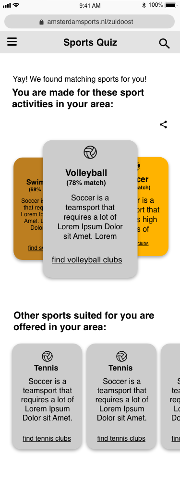

# meesterproef

##### Student: Jesse Dijkman (500754406)

For the final assessment we picked a case we would work on for five weeks. Bas, Sterre, Robin and I picked: "Sportaanbuid Amsterdam zuid-oost" (sports offer in Amsterdam southeast). In this project we will work together with students from the UX minor.

My teammates are:

- [Bas Pieren](https://github.com/BasPieren)
- [Sterre van Geest](https://github.com/sterrevangeest)
- [Robin Stut](https://github.com/RobinStut)

## Table of Contents

- [Introduction](#introduction)
- [Stakeholders](#stakeholders)
- [Context](#context)
- [Design Decisions](#design-decisions)
- [Learning Goals](#learning-goals)
- [Design Rationale](#design-rationale)
- [Product Biography](#product-biography)
  - [Week 0](#week-0)
  - [Week 1](#week-1)
  - [Week 2](#week-2)
  - [Week 3](#week-3)
  - [Week 4](#week-4)
  - [Week 5](#week-5)
- [Reflection](#reflection)
- [Licence](#licence)

## Introduction

In Amsterdam southeast the department of Sports promotion handles the promotion of local sports. This department wants a platform where all the data about sports, clubs and sportevents is present. To make it easier for the people to find a sport that best suits them. [source](https://docs.google.com/document/d/1rGpTHru01Bwv5cI0S_uIRzKIhpin6NFvCFTZ7P1Cdak/edit)

We (the developers) will develop a prototype that can be used for testing purposes. If the client likes the prototype they could hand it over to a professional development agency.

## Stakeholders

1. **The people of Amsterdam southeast:** The main target group for whom the app will be built.
2. **The sport providers:** The sportproviders play a big part in creating, maintaining their data. They will have access to a dashboard where they can update, add or remove information about their club/organization.
3. **The sports brokers:** These are the people that help the inhabitants of southeast to find sports. The app will help them by providing a list of clubs and sports.

## Context

The context is different for each stakeholder

For the inhabitants the context is anywhere as long as he/she has his/her smartphone.

For the providers the context is anywhere where they can update, maintain their accounts. Most likely with a laptop or desktop.

For the sports brokers the context is anywhere with an inhabitant of southeast, where they will go through the app together.

## Design Decisions

- Event based (group)
- Swipe functions (personally)

## Learning Goals

For this project we had to set learning goals for ourselves. Which I actually found pretty hard to do. Because I just want to program to get better and not really a specific thing. But I actually had some learning goals without realizing it.

##### [Web app from scratch](https://github.com/cmda-minor-web/web-app-from-scratch-1819)

> You can create structure in you code by applying patterns

I want to get more familiar with using modules and classes (OOP). So I'm going to try to code mostly using classes.

##### [CSS to the rescue](https://github.com/cmda-minor-web/css-to-the-rescue-1819)

> You understand the broader scope of CSS: You can show that CSS can be used for more than just styling web pages.

I want to use more CSS for a lot of things. This goes hand-in-hand with browser support. Because a lot of cool things you can do with CSS have great browser support.

##### [Browser technologies](https://github.com/cmda-minor-web/browser-technologies-1819)

> What is Progressive enhancement en how can you apply it?

I want to create cool looking things that can also can be used/seen on older browsers.

## Design Rationale

The design rationale can be found on [Gitbook](https://meesterproef.gitbook.io/design-rationale/)

## Product Biography

### Week 0

This was 1 week prior to the official start of the final assessment of the minor: "Web development". In this week we had our last resits for the courses. And on Monday we had our kick-off for the final assessment ([meesterproef](https://github.com/cmda-minor-web/meesterproef-1819)).

During the kick-off we met with Harry who is the client, Daan who is the main contact who connected us with Harry and four interantional UX students who we're also doing their final assessment for the UX minor.

During this kick-off we were given a briefing about the problem and what the UX'ers had already done.

##### The Problem

> "There are many sport providers in Zuidoost (around 180), but the participation of the inhabitants (around 900.000) in sport activities there is the lowest in whole Amsterdam. Providers often have difficulty in spotlighting their offer and potential users may have problems to find what they are looking for." - UX Students

##### The Assignment

> "Design digital interfaces so the full range of sports in Zuidoost in the first place and secondly for whole Amsterdam can be reached. The platform should function as an overview for all sport offerings." - UX Students

So what's needed is a platform that has a collection of all available sports and sports clubs. We also covered what's possible and the things we needed. One thing was clear, we needed data. Luckily Amsterdam has a lot open [data](http://data.amsterdam.nl) that we can use for the prototype we were going to make

But to actually get to work we needed some wireframes, which the UX'ers worked on during the weekend. And we needed to pass our resits ofcourse.

### Week 1

On Tuesday we had a meeting with Daan and Harry, where the UX'ers showed us the wireframes they had made. But because of a public transport strike I couldn't actually make it to the meeting, but I joined with Skype and a bad internet connection. Because I used Skype I couldn't really see the wireframes that well, but I understood that a community would play a big part. Also Harry would set us up with people to test the wireframes with, the next week.

The next day we started with setting up the [github repository](https://github.com/RobinStut/meesterproef) and the server, for which I created a `routes.js` module. We also just tried to get a bit more familiar with using git together. This created a bunch of merge conflicts, so bad that I had to make a force push to reset the repository.

This was basically the whole week, we only worked two days because we also had "Hemelvaartsdag". But at home I started working on a `DraggingEvent` class that would register mouse dragging.

### Week 2

This week we continued with the setup, and had a meeting with the UX'ers on Monday to prepare for the tests the next day. Harry brought us into contact with Gilbert and Eline. Eline is a highschool gym teacher, and Gilbert is a sportsprovider/coach.

On Monday we discussed with the UX'ers what we we're going to test and who would go with whom. Me and Bas went with Johanna and test with Gilbert and his people. Sterre and Robin went with Lisa and Christian to the highschool to test with students.


> Meeting with the UX students

When Bas, Johanna and I arrived at Amsterdam southeast for the testing, I was surprised when we met Gilbert; who turned out to be a coach of a walking soccer team. And the test we planned on doing ended up being more of an interview. Which was great, because I never thought about elders using the app. This interview gave us some insights, like why they practice sport:

- To stay healthy
- To have fun

And why they participate in tournaments:

- To meet new people
- To learn from eachother

These insights actually match really well with the concept of the UX'ers. The concept is meant to improve health overall in Amsterdam southeast, it's a platform to meet new people and inspire/learn (from) each other. Also an insight we got from the interview was that browser support is a thing to keep in mind. Because the elders don't really use apps or atleast not like the youth.


> The test with the walking soccer team

After the interview we met with Robin, Sterre, Lisa and Christian at world of foods to discuss the test results. And later in the afternoon we had a meeting with Daan and Vincent; a sports broker who filled in for Harry. During this meeting Vincent told us what he thinks would be important for him to have in the app. Because Vincent meets a lot of people in Amsterdam southeast who want to sport, but have no clue where to look. Vincent could really benefit from a list of clubs and sports.

The rest of the week we worked on the app. Robin worked on the quiz, which was already close to done. And on Friday we had our first talk with Koop; our project coach. During this talk we told him how we felt about testing, and why we thought it was mostly the UX'ers their jobs to do it. He told us that we're CMD students and we also do testing because it's important. But we all just wanted to program and make cool stuff, not do testing. But I get why we also have to do it, since we're from CDM and not ICT. After the meeting/talk we sat down to get our priorities straight. To do this we used a **M**O**SC**O**W** chart (**MUST** have, **SHOULD** have, **COULD** have, **WONT** have)


> **M**O**SC**O**W** chart

In the end I spent most of the week on the `CustomSlider` class, which I made on codepen for easy testing. The point of the `CustomSlider` class was to create custom sliders. The way it works is you have a normal range input that works on every browser and create a custom one on top of it. This way without JavaScript you'd still be able to use the normal range input (progressive enhancement). The `CustomSlider` extends the `DraggingEvent` which I finished the weekend before week 2. This was also the first time I used "closure", which I never understood before this.

```js
getDistance(callback) {
    function distanceInit(event_1) {
      const startingX = e1.clientX
      const startingY = e1.clientY

      return function(event_2) {
        if (e2 === null) {
          return callback(null)
        } else {
          return callback({
            x: event_2.clientX - startingX,
            y: event_2.clientY - startingY
          })
        }
      }
    }

    this.event(distanceInit)
  }
```

I did this to let users use a callback, that is only called when the user drags. How you use it is like this:

```js
// When in a different class that extends DraggingEvent

class CustomSlider extends DraggingEvent {
  constructor(target) {
    super(target)

    super.getDistance(this.handler.bind(this))
    // OR
    super.getPosition(this.handler.bind(this))
  }
}

// Or anywhere else

new DraggingEvent(target).getDistance(handler)

function handler(data) {…}
```

### Week 3

Because Robin was almost done with the quiz Robin and I went to talk to the UX'ers about the quiz and show them what Robin had made so far.


> Robin and I with the UX'ers

And later that week Robin and Sterre tested the quiz with students at the HvA campus.

The rest of the week I worked on the `CustomSlider` which I finished, I then started working on a `Carousel` class, also in codepen. Which was on the result page after finishing the quiz on the prototype of the UX'ers.



> Carousel on the results page, after the quiz

The `Carousel` is also a class so it could easily be used on different pages, maybe also on future projects. The `Carousel` was probably the most complicated thing I worked on a while. Because it required math, atleast in the way I wanted to make it. To do this I used an [online tool](https://www.desmos.com/calculator), and I'll be honest ... I spent waaaaay too much time in this tool, because I wanted to get it perfect. But then I remembered that I don't even study maths.

During this week I also had my first code review with [Vasilis](https://github.com/vasilisvg), who I told about my struggle with the `Carousel`. And why I should go to rehab for my codepen addiction. Because codepen is great, but you don't have a commit history. I had a bit of trouble with the code review because I didn't have any questions. I was too busy with programming.

The next day we had a meeting with Koop. With whom we talked about our progress and collaboration with the UX'ers and how this held us back. It became clear to us that we needed to work on our own project and not on theirs. So we made the decision to work on our own twist of the original concept. We went more in a event-based direction, instead of clubs. The main point of this was to encourage people to join try-outs, trainings.

### Week 4

This week we had another meeting (for which we had to prepare on Monday)with Vincent, Daan and the UX'ers. This would be the first time we showed our prototype. So Monday we worked on some details. I added the `Carousel` I had created on codepen to the app. I did this in steps/commits so there still is some kind of process in the commit history for the `Carousel`.

The next day Bas addressed that the code should get some guidelines because the code didn't have any consistency. So we hijacked a classroom where Bas connected his laptop to the bigscreen.


> Refactoring on the big screen

To have a bit of consistency in our project' code, we decided to use [prettier](https://prettier.io/). Which is easy to use on VScode I feel like and less easy on Atom. So I installed VScode, and first had to get used to it but ended up liking it a lot.

After discussing the guidelines for the code, we went over the file structure. Because this was also starting to look messy and unorganized.


> New file structure (credit to Sterre, Bas and Robin)

This was great, because it meant that we we're learning to better work as a group. And to use git better and keep things organized.

Later in the day we had a where Bas held a short presentation of what we've built so far. But to be honest they seemed to be way more excited with what the UX'ers had done. Which looked cool, but won't actually work online. So I felt a little underappreciated, which isn't fair to them either. Because I know how much work something is, doesn't mean they do. For example the `Carousel` which has a lot of calculations behind the screens. But for them it's just something they see in most apps.

Also Vincent didn't seem very happy with our new direction (event-based). For example now when you finish the quiz you get a list of events, instead of clubs. Which he wasn't very happy with. Which I understand because the list of clubs is really useful for him. In the end we implemented both clubs and events with events being the focus. After the presentaion we narrowed our focus down to three paths:

- User: The path the user takes to find a sport for him
- Sports broker: The path the sports broker takes to find a sport for someone else
- Sport provider: The dashboard and creation of events path.

Next day (Wednesday) me and Robin worked on refactoring the client JavaScript, which didn't need much refactoring. I also worked on a second and improved version for the custom slider.

The previous version of the slider would use the `getDistance()` method from the `DraggingEvent`. Which wasn't very great if I look back at it now. So now I changed it so it uses the `getPosition()` method. The new version worked a lot different and better. Because now instead of calculating the position, based on the previous position and distance, the possible positions were created at the init and stored in an array. Now I just needed to look at the mouse position and the values in the array.

### Week 5

Final week. In the weekend before the final week I worked on fixing bugs and I worked on a new feature; a pop-up. Which is created using only CSS. Which looks like this:

```css
.pop-up {
  --duration: 0.3s;
  filter: blur(0px) !important;
  height: 100%;
  width: 100%;
  position: fixed;
  bottom: 100%;
  left: 0;
  opacity: 0;
  transition: bottom 0s ease calc(2 * var(--duration)), opacity var(--duration) ease
      calc(var(--duration) / 2);
  padding: 2em;
  overflow: scroll;
  background: radial-gradient(
    ellipse at center,
    rgba(0, 0, 0, 0.8) 0%,
    rgba(0, 0, 0, 0.75) 100%
  );
  z-index: 100;
}

#pop-up-toggle:checked ~ .pop-up {
  transition: bottom 0s ease, opacity var(--duration) ease;
  bottom: 0;
  opacity: 1;
}
```

When the `#pop-up-toggle` is checked it will have a different transition than when it's not. Which I actually had never done before I think.

With JavaScript I enhanced the pop-up. I created an `InteractiveCards` class that would make it possible to swipe the events in the pop-up to remove them. But I kind of forgot about the affordance; how do you know the cards can be swiped?. This became clear after we had our talk with Koop. So after this talk I worked on an animation which made the cards slide into the screen. To (try) give the hint that they could be moved.

On Tuesday I worked on refactoring the routes and some modules that were being used on the server. For example instead of using `fs` we used `node-fetch` for reading files that were in the file structure of the app. This meant it relied on an internet connection, which wasn't ideal.

So I created a new file were you can choose to fetch a url or a file.

And later that day I added more CSS to the pop-up. Including a new floating-action button with a bell icon that has an animation which I think looks great.


> The notification bell animation

And the rest of the week just ended up being a lot fixing bugs and on Wednesday we had a presentation to give to Harry (who had just returned from his vacation), Vincent, Daan and one other person.

## Reflection

For this project I had to state my learning goals. You can read my learning goals [here](#learning-goals)

### [Web app from scratch:](https://github.com/cmda-minor-web/web-app-from-scratch-1819)

One of my learning goals came from web app from scratch. The learning goal was to work more structured by using modules and classes. So that's what I did. The first module I created was on the server. This module was for the routes, where all the routes are placed. On the client I created in total four classes are exported as modules:

- `DraggingEvent`
- `CustomSlider`
- `Carousel`
- `InteractiveCards`

I created these all with the intention to minimize the amount of code. And make it easier to reuse these functionalities. Along the way I also learned about closure, which was a concept that I had trouble with understanding ever since I heard from it.

##### [CSS to the rescue:](https://github.com/cmda-minor-web/css-to-the-rescue-1819)

Another learning goal of mine was to use CSS where ever I could. This was a learning goal that I didn't do much myself. But I showed Robin a way to create a section slider, with just CSS. And the pop-up I created is also with only CSS. Except for certain things that would just be a wast of time to do with CSS.

##### [Browser technologies:](https://github.com/cmda-minor-web/browser-technologies-1819)

My last official learning goal was to use progressive enhancement. Where this return in the code is at the custom slider, and carousel (atleast used to). For the cusotm slider you start with a normal range input, which is used as template for the custom slider class. Data like:

- Minimum & maximum value
- Default value
- Steps

are extracted from the range input and used in the generation of the custom slider. The range input is never deleted. It's only visually hidden so a blind user could still use it with his tab key.

## Sources

- UX students (Lisa, Johanna, Ruby, Christian)
- [Bas Pieren](https://github.com/BasPieren)

## Licence

MIT © [Jesse Dijkman](https://github.com/jesseDijkman1)
